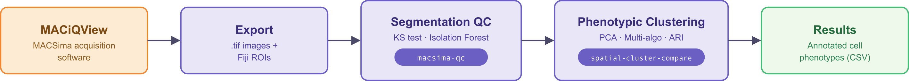
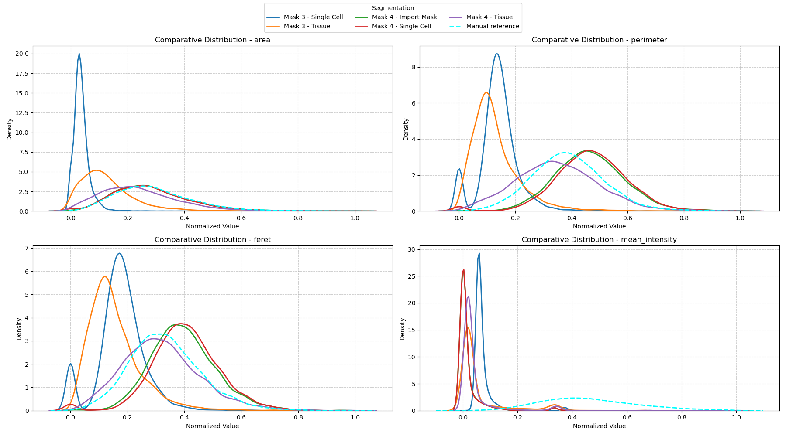
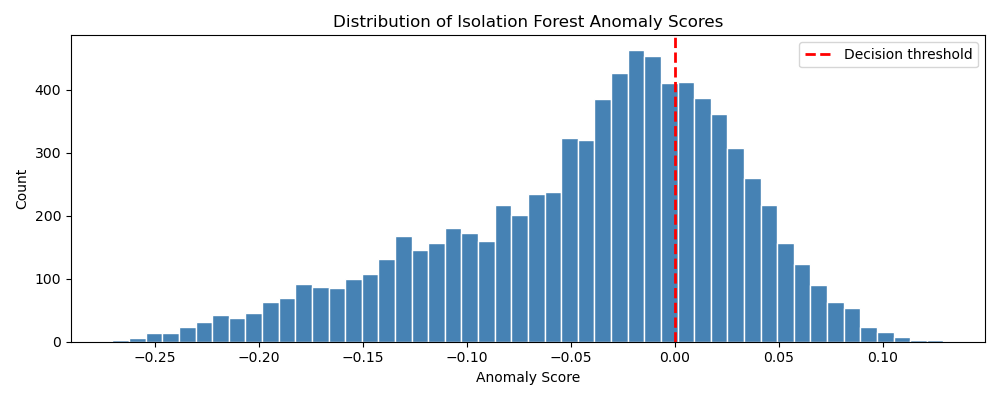

<div align="center">

# 🔬 Spatial-Omics Pipeline

[](#)
[](#)
[](#)
[](#)
[](https://github.com/mathisbouvet/MACSima_Spatial-Omics-Pipeline/commits/main/)
[](#citation)

**A methodological framework for Python-based analysis of immunofluorescence spatial data.**  
*This repository focuses on the validation and benchmarking of analytical pipelines.*

<br>

**Mathis Bouvet**  
*Biologist — Reproduction & Development*  
March 2026

</div>


## Pipeline Architecture

The workflow is structured into two main components: segmentation quality control and clustering-based phenotypic characterization. Each component is documented here as a step-by-step protocol, and packaged as a standalone, installable Python library.

> **Data Origin**: Raw multiplex imaging data is acquired on the MACSima platform via **MACiQView**, then exported and processed through the Python pipelines described below.

<div align="center">



</div>

## Table of Contents
- [Pipeline Architecture](#pipeline-architecture)
  - [I. Segmentation Quality Control](#i-segmentation-quality-control)
  - [II. Unsupervised Phenotypic Characterization](#ii-unsupervised-phenotypic-characterization)
- [Notebooks](#notebooks)
- [Methodological Stack](#methodological-stack)
- [Citation](#citation)


### I. Segmentation Quality Control

[](https://github.com/mathisbouvet/macsima-qc/actions/workflows/tests.yml)
[](https://pypi.org/project/macsima-qc/)
[](https://github.com/mathisbouvet/macsima-qc/blob/main/LICENSE)

> **Problem:** How can the reliability of automated segmentation in biological tissues be quantitatively assessed?

This module, detailed in [`01_segmentation_qc.md`](protocols/01_segmentation_qc.md), includes:

- **Standardization**: Conversion of complex ROI structures (Fiji) into programmatically usable binary masks.  
- **Fidelity Analysis**: Comparative evaluation using the **Kolmogorov–Smirnov test** to identify the most accurate segmentation method.  
- **Isolation Forest**: Detection of artefacts and aberrant segmentations through multidimensional anomaly detection.  
- **Recommendation Engineering**: Application of **Mann–Whitney U tests** to guide parameter optimization (e.g., smoothing, sensitivity).

<table>
<tr>
<td width="50%"></td>
<td width="50%"></td>
</tr>
</table>

📦 Packaged as **[`macsima-qc`](https://github.com/mathisbouvet/macsima-qc)**, available on PyPI:

```bash
pip install macsima-qc
```

---

### II. Unsupervised Phenotypic Characterization

[](https://pypi.org/project/spatial-cluster-compare/)
[](https://github.com/mathisbouvet/spatial-cluster-compare/actions/workflows/tests.yml)
[](https://github.com/mathisbouvet/spatial-cluster-compare/blob/main/LICENSE)

> **Problem:** How can clustering validity be ensured in large and heterogeneous cellular populations?

The protocol described in [`02_comparaison_cluster.md`](protocols/02_comparaison_cluster.md) includes:

- **Clusterability Assessment**: Use of the **Hopkins statistic** to validate the presence of inherent structure prior to clustering.  
- **Dimensionality Reduction (PCA)**: Projection preserving 90% of protein variance.  
- **Automatic K Selection**: Consensus strategy combining **Silhouette**, **Davies–Bouldin**, and **Calinski–Harabasz** indices.  
- **Stability Analysis (ARI)**: Robustness evaluation via 80% bootstrapping using the **Adjusted Rand Index**.

📦 Packaged as **[`spatial-cluster-compare`](https://github.com/mathisbouvet/spatial-cluster-compare)**, available on PyPI:

```bash
pip install spatial-cluster-compare
```

---

## Notebooks

The exploratory analyses behind both modules are available as Jupyter notebooks in [`/notebooks`](notebooks):

- Development notebook for the segmentation QC protocol, prior to packaging as `macsima-qc`.
- Development notebook for the clustering validation protocol, prior to packaging as `spatial-cluster-compare`.

---

## Methodological Stack

| Category | Tools & Libraries |
| :--- | :--- |
| **Acquisition** | MACSima — `MACiQView` |
| **Data Science** | `Scikit-Learn`, `Pandas`, `NumPy` |
| **Statistics** | `SciPy` (non-parametric tests, distributions) |
| **Bio-Imaging** | `OpenCV`, `Scikit-Image`, `Read-ROI` |
| **Visualization** | `Matplotlib`, `Seaborn` |

---

## Citation

If you use `macsima-qc` or `spatial-cluster-compare` in your research, please consider citing this repository:

```bibtex
@software{bouvet_spatial_omics_pipeline,
  author  = {Bouvet, Mathis},
  title   = {Spatial-Omics Pipeline: A methodological framework for Python-based analysis of immunofluorescence spatial data},
  year    = {2026},
  url     = {https://github.com/mathisbouvet/MACSima_Spatial-Omics-Pipeline}
}
```

---

<br>

> **Ethical Note**: This repository is a methodological showcase and does not contain real biological data.